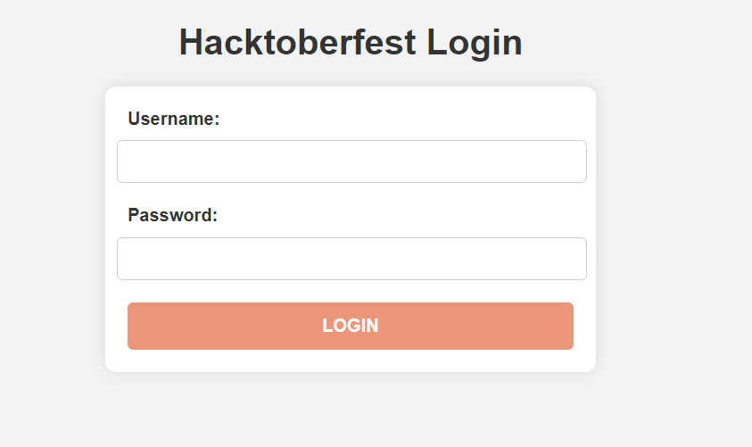
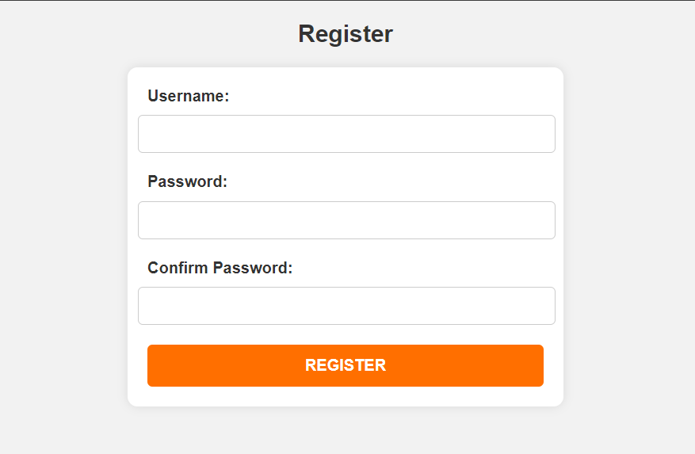

# Login and Register Pages

These are basic HTML files for a login and register page. They can be used as a starting point for building authentication systems in web applications.

## Contents

- [Login Page](#login-page)
- [Register Page](#register-page)

## Login Page

The `login.html` file contains a simple HTML form for user login.

### Usage

1. Open `login.html` in a web browser.
2. Enter your username and password.
3. Click the "Login" button.

### Preview

## Register Page

The `register.html` file contains a simple HTML form for user registration.

### Usage

1. Open `register.html` in a web browser.
2. Enter a username, password, and confirm the password.
3. Click the "Register" button.

### Preview

